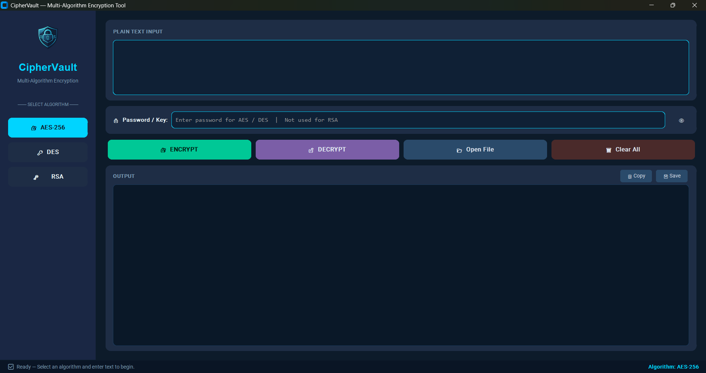
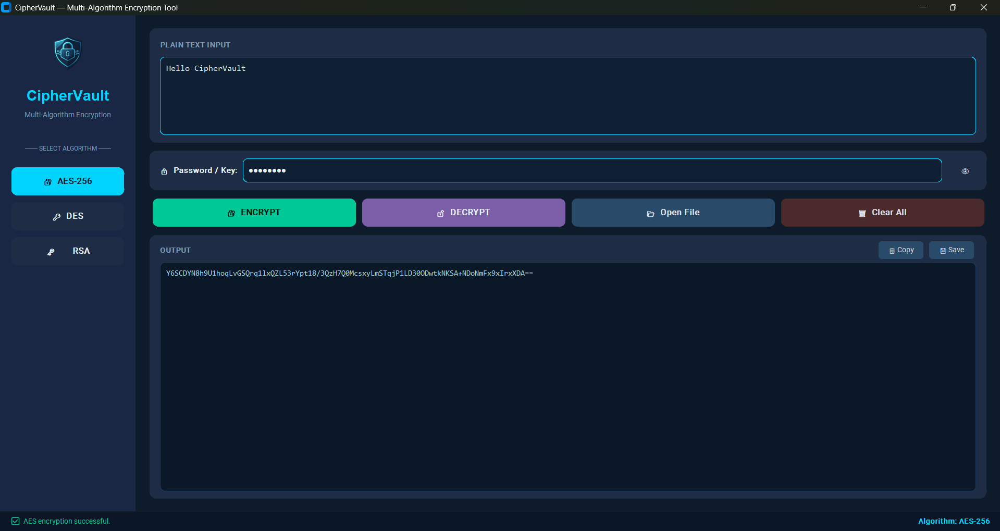

# 🔐 CipherVault

A modern desktop application for secure text encryption and decryption using **AES-256**, **DES**, and **RSA** algorithms. Built with **Python** and **CustomTkinter**, CipherVault provides a clean, user-friendly interface to learn and experiment with cryptography.

---

## 📸 Screenshots

### 🏠 Home Screen



### 🔐 AES Encryption




---

## 🎥 Project Demo

📹 **Watch the complete project demonstration:**

**Google Drive:**
https://drive.google.com/file/d/1QlY5QZdt4VX2Doie_CsgBx1jdQBbbbIM/view?usp=sharing

---

## ✨ Features

* 🔐 AES-256 Encryption & Decryption
* 🔑 DES Encryption & Decryption
* 🛡 RSA Key Generation, Encryption & Decryption
* 📂 Open & Save Text Files
* 📋 Copy Output to Clipboard
* 🗑 Clear Input & Output
* 🌙 Modern Dark User Interface

---

## 🛠 Tech Stack

* Python
* CustomTkinter
* PyCryptodome
* Pillow
* Pyperclip

---

## 📂 Project Structure

```text
CipherVault/
│
├── algorithms/
├── assets/
├── screenshots/
├── utils/
├── main.py
├── ui.py
├── requirements.txt
└── README.md
```

---

## 🚀 Installation

```bash
git clone https://github.com/jainsnow47-arch/CipherVault.git

cd CipherVault

pip install -r requirements.txt

python main.py
```

---

## 📚 What I Learned

* Python GUI Development
* Cryptography Fundamentals
* AES, DES & RSA Algorithms
* File Handling
* Object-Oriented Programming
* Git & GitHub Workflow

---

## 🔮 Future Improvements

* File Encryption
* Folder Encryption
* Password Generator
* SHA-256 Hash Generator
* Theme Switching
* Windows Executable (.exe)

---

## 👨‍💻 Developer

**Snow Jain**

B.Tech Computer Science Engineering Student

Interested in **Cybersecurity, Python Development, Artificial Intelligence, and Backend Development.**

⭐ If you found this project useful, consider giving it a **Star** on GitHub!
